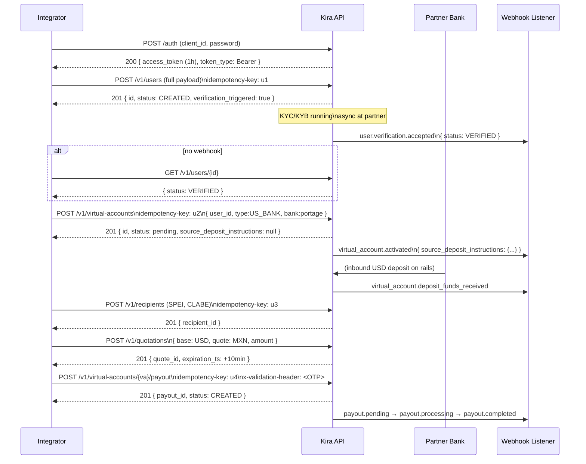
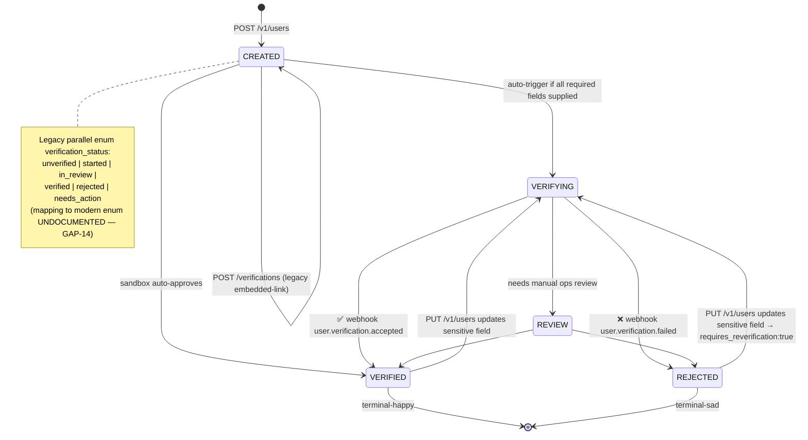
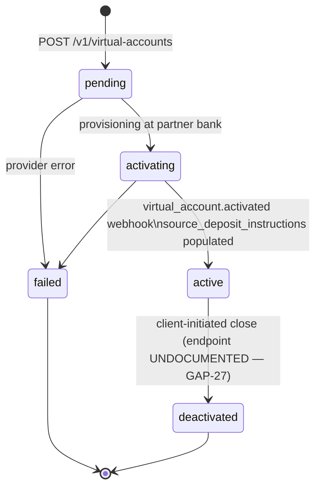
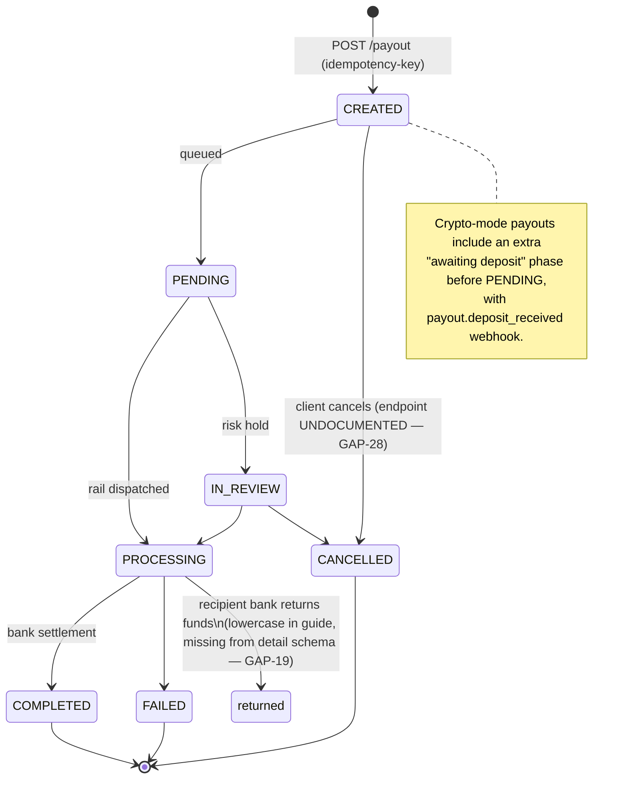

# Kira API — Integration Reference & Architectural Contract

> **Audience:** An engineer who needs to build *any* integration against Kira (not just the minimum flow for PM Exercise 2).
> **Source crawl:** `https://kira-financial-ai.readme.io/llms.txt` index (28 docs pages + 30 reference pages + 5 changelog entries, version `v2026-04-14`). `llms-full.txt` does not exist (404) — content reconstructed from per-page fetches. Every endpoint row links to its source.
> **Last verified:** 2026-05-27.
> **Conventions in this doc:** `UNDOCUMENTED — see GAP-NN` marks an intentional gap. `<REDACTED>` replaces any sample bearer/api-key/SSN that appeared in source. All paths shown are relative to a base URL; see §1.

---

## 1. Overview

Kira ("Balam" in the API hostname) is a unified fintech infrastructure platform exposing five product lines through one REST surface:

| Product line | Endpoints touched | Direction |
|---|---|---|
| **User & verification (KYC/KYB)** | `/v1/users`, `/v1/users/{id}/verifications` | Prerequisite for all financial products |
| **Virtual USD accounts** (FDIC-insured, via partner banks Portage / Austin Capital Trust / Slovak Savings Bank) | `/v1/virtual-accounts`, `/v1/virtual-accounts/{id}/balance`, `/v1/virtual-accounts/{id}/deposits` | Inbound USD via ACH, Wire (domestic), SWIFT, FedNow/RTP |
| **On-ramps** (fiat → USDT/USDC, via PayIns) | `/v1/payins`, `/v1/payins/fees`, `/v1/payment-link` | Inbound MXN (SPEI), COP (PSE), USD (ACH) → stablecoin settlement |
| **Off-ramps / Payouts** (USD or stablecoins → local fiat) | `/v1/virtual-accounts/{id}/payout`, `/v1/payouts`, `/v1/recipients`, `/v1/quotations` | Outbound to 14 LATAM currencies + SWIFT global |
| **Liquidation addresses** (auto-convert inbound stablecoin → USD → bank) | `/v1/virtual-accounts/{id}/liquidation-address` | Stablecoin → fiat sweep |

### 1.1 Base URLs

| Environment | Base URL |
|---|---|
| **Sandbox** | `https://api.balampay.com/sandbox` |
| **Production** | `https://api.balampay.com` |

Sandbox and production are differentiated **by URL prefix only**. There is no `X-Environment` header. The auth endpoint shares the base URL — i.e. sandbox auth is `POST https://api.balampay.com/sandbox/auth`. [source: getting-started.md, post_auth.md]

### 1.2 Versioning model

This is the **single most architecturally surprising** piece of the contract; integrators will get it wrong:

- The version `v2026-04-14` lives **only in the docs URL path**. It is **not** part of the API URL path (all endpoints start with `/v1/...`).
- A changelog entry dated 2026-04-14 ("Documentation accuracy pass") states that an `X-Api-Version` header exists with two values today — `2025-01-01` (default for existing clients) and `2026-04-14` (latest) — and promises an "API Versioning page added under Getting Started."
- That guide page **does not actually exist** at `/docs/api-versioning.md` or `/docs/versioning.md` (both return 404). The header is announced but never specified in the reference.
- No example request anywhere in the docs sets `X-Api-Version`. Whether requests without the header receive `2025-01-01` (old schema) or `2026-04-14` (new schema) is therefore inferable but not stated.

→ See **GAP-01**.

### 1.3 What Kira is *not*

Kira does **not** execute fiat-to-fiat conversions (e.g. USD → MXN). Every cross-currency flow routes through stablecoins on the back end even if the caller never touches one — the `kira_rate` in `/v1/quotations` is the post-conversion effective rate. Any docs example implying direct USD → MXN settlement is shorthand; on the rails it's USD → USDC → MXN.

---

## 2. Cross-Cutting Contracts

### 2.1 Authentication — `POST /auth`

[source: [post_auth.md](https://kira-financial-ai.readme.io/reference/post_auth.md), [docs/authentication.md](https://kira-financial-ai.readme.io/docs/authentication.md)]

**Endpoint:** `POST /auth` (same base URL as everything else, sandbox or production)

**Required headers**

| Header | Required on `/auth`? | Required on every other endpoint? |
|---|---|---|
| `x-api-key` | Yes | Yes (all endpoints) |
| `Authorization: Bearer <jwt>` | **No** (this call obtains it) | Yes (all except `/auth` and `POST /webhooks/register`) |
| `Content-Type: application/json` | Yes (for POST/PUT) | Yes (for POST/PUT) |
| `idempotency-key` | No | Required on **7 create endpoints**, see §2.4 |
| `x-validation-header` | No | Optional OTP for **fiat payouts only** |
| `X-Api-Version` | UNDOCUMENTED — see GAP-01 | UNDOCUMENTED — see GAP-01 |

**Request body**

```json
{
  "client_id": "<UUID — from KIRA_CLIENT_ID env var>",
  "password": "<from KIRA_COGNITO_SECRET env var>"
}
```

**Success response (200)**

```json
{
  "message": "Auth token",
  "data": {
    "access_token": "<REDACTED — JWT>",
    "expires_in": 3600,
    "token_type": "Bearer"
  }
}
```

**Observable contract**

- Token TTL: **1 hour** (3600 s, fixed; no refresh endpoint documented — see GAP-02).
- Expired token: API returns `401` with body `"The incoming token has expired."` (per docs/authentication.md). Re-auth and retry; there is no refresh token grant.
- The successful body is wrapped in `{ message, data }`. **No other endpoint uses this envelope** — every other success returns either a flat object or a `data: { ... }` (quotations) or `payouts: [ ... ]` (list payouts). This is inconsistency, see GAP-03.

**Error shapes observed on `/auth`**

| Status | Shape | Notes |
|---|---|---|
| 403 | `{"message": "Forbidden"}` | No `code` field |
| 422 | `{"message": "Invalid input data", "data": [{"type": "uuid_parsing", "loc": ["body", "client_id"], "msg": "..."}]}` | Pydantic-style validation list |
| 500 | `{"message": "Service unavailable", "data": {"error": "Service unavailable"}}` | Note: 500 reports "Service unavailable" — semantically a 503 |

### 2.2 Required headers by endpoint (canonical map)

| Endpoint | `x-api-key` | `Authorization` (Bearer) | `idempotency-key` | `x-validation-header` |
|---|---|---|---|---|
| `POST /auth` | ✓ | — | — | — |
| `POST /v1/users` | ✓ | ✓ | **✓ (UUID v4)** | — |
| `GET/PUT /v1/users/{id}` | ✓ | ✓ | — | — |
| `POST /v1/users/{id}/verifications` (legacy) | ✓ | ✓ | **✓** | — |
| `POST /v1/users/{id}/virtual-accounts` *(per idempotency.md)* / `POST /v1/virtual-accounts` *(per reference)* | ✓ | ✓ | **✓** | — |
| `POST /v1/users/{id}/wallets` | ✓ | ✓ | **✓** | — |
| `POST /v1/recipients` | ✓ | ✓ | **✓** | — |
| `POST /v1/virtual-accounts/{id}/payout` | ✓ | ✓ | **✓** | Optional OTP, fiat only |
| `POST /v1/batch-payouts` | ✓ | ✓ | **✓** | — |
| `POST /v1/virtual-accounts/{id}/liquidation-address` | ✓ | ✓ | **✓** | — |
| `POST /v1/payins` | ✓ | ✓ | **✓** | — |
| `POST /v1/payins/fees` | ✓ | ✓ | — | — |
| `POST /v1/payment-link` | ✓ | ✓ | — | — |
| `POST /webhooks/register` | ✓ | **— (no JWT)** | — | — |
| `POST /v1/quotations` | ✓ | ✓ | — | — |
| All `GET` endpoints | ✓ | ✓ (or `x-api-key` alone on some — see GAP-04) | — | — |

> **`POST /webhooks/register` is the only documented endpoint that does not require a Bearer token** — `x-api-key` alone authenticates it. Many `GET` endpoints describe "Bearer OR API key" (`oneOf` security in the OpenAPI), which contradicts the docs/authentication.md statement that "both" are always required. → GAP-04.

### 2.3 Error envelope — three coexisting shapes

The docs claim a uniform error envelope but the reference pages expose **three distinct shapes**:

**Shape A — flat (code + message)**, used by user/virtual-account/balance endpoints:

```json
{ "code": "not_found", "message": "User with ID ... not found" }
```

Known `code` values: `validation_error`, `unauthorized`, `not_found`, `invalid_user_id`, `invalid_operation`, `forbidden`, `resource_conflict`, `rate_limit_exceeded`, `idempotency_key_reused`, `idempotency_conflict`.

**Shape B — nested under `error`**, used by recipients, payouts, payins, quotations:

```json
{ "error": { "code": "VALIDATION_ERROR", "message": "CLABE must be exactly 18 digits", "details": { } } }
```

Codes here are SCREAMING_SNAKE_CASE (e.g. `USER_NOT_FOUND`, `PAYOUT_NOT_FOUND`, `PAYOUT_ACCESS_DENIED`, `INVALID_BANK_CODE`, `FEES_EXCEED_AMOUNT`, `QUOTE_NOT_FOUND`, `QUOTE_INVALID_STATE`, `INVALID_CALCULATED_AMOUNT`, `CURRENCY_PAIR_NOT_ENABLED`, `INTERNAL_SERVER_ERROR`, `AUTHENTICATION_ERROR`, `INTERNAL_ERROR`, `IDEMPOTENCY_CONFLICT`).

**Shape C — Pydantic list with `loc`** (only seen on `/auth` 422 today, but the schema-validation guide implies it can appear on any endpoint):

```json
{
  "error": "Invalid request data",
  "details": [
    { "path": "field.name", "message": "...", "code": "..." }
  ]
}
```

And the `/auth` flavor uses `loc` (`["body", "client_id"]`) instead of `path`. → **GAP-05** — this kills generic error handlers.

A `request_id` / correlation ID is **never** in any error body or success header sample → **GAP-06**.

### 2.4 Idempotency

[source: [docs/idempotency.md](https://kira-financial-ai.readme.io/docs/idempotency.md)]

**Header name:** `idempotency-key` (lowercase in all docs examples — not `Idempotency-Key`).

**Format:** valid UUID, v4 recommended.

**TTL:** 24 hours from first use. After that the key is reusable for a *new* operation.

**Required on seven create endpoints** (per idempotency.md):
- `POST /v1/users`
- `POST /v1/users/{userId}/verifications`
- `POST /v1/users/{userId}/virtual-accounts`
- `POST /v1/users/{userId}/wallets`
- `POST /v1/recipients`
- `POST /v1/payouts` *(but no such endpoint exists in the reference — see GAP-07; the actual payout endpoint is `POST /v1/virtual-accounts/{id}/payout`)*
- `POST /v1/batch-payouts`

The April 14 changelog adds `POST /v1/liquidation-address` to the list. `POST /v1/payins` requires it per the PayIn reference (also added in the changelog). So the true list is **9 endpoints, not 7** as the dedicated guide claims. → **GAP-08**

**Response semantics**

| Scenario | Status | Body |
|---|---|---|
| Same key + same body | 200 / 201 (cached) | Original response replayed |
| Same key + same body, recipient already exists | 202 | Recipient response (recipients endpoint only) |
| Same key + **different** body | 409 | `{ "code": "idempotency_key_reused", "message": "..." }` (Shape A) or `{ "error": { "code": "IDEMPOTENCY_CONFLICT", ... } }` (Shape B) — inconsistent across endpoints |
| Missing key on required endpoint | 400 | `{ "code": "validation_error", "message": "Idempotency key is required" }` |

The accuracy-pass changelog calls out that VA-creation idempotency conflicts used to be incorrectly documented as `400 validation_error`; the truth is `409 idempotency_key_reused`. Sandbox behavior here is worth re-verifying — there is a real risk of doc drift surviving. → see GAP-08.

### 2.5 Pagination

Two coexisting models:

| Endpoint | Model | Params |
|---|---|---|
| `GET /v1/users`, `GET /v1/virtual-accounts`, `GET /v1/virtual-accounts/{id}/deposits`, `GET /v1/virtual-accounts/deposits` | **Offset** | `limit` (1–100, default 10), `offset` (default 0); response has `pagination: { total, limit, offset, has_more }` |
| `GET /v1/payouts` | **Page-based** | `page` (≥1, default 1), `limit` (1–100, default 10); response has `total`, `page`, `limit`, `total_pages` |

→ **GAP-09**. No cursor-based pagination anywhere; total counts are real (no estimation noted).

### 2.6 Rate limiting

[source: docs/authentication.md]

Per-API-key usage plan, default:
- **10 requests / second**
- **2 concurrent requests**
- **10,000 requests / week**

Response headers on every call (per docs): `RateLimit-Limit`, `RateLimit-Remaining`, `RateLimit-Reset`.
On 429: `Retry-After` (seconds) included.

No per-endpoint cost weighting documented. No burst allowance documented. → **GAP-10**.

### 2.7 Webhooks

[source: [docs/webhooks-guide.md](https://kira-financial-ai.readme.io/docs/webhooks-guide.md), [docs/webhooks-event-types.md](https://kira-financial-ai.readme.io/docs/webhooks-event-types.md), [docs/virtual-account-webhooks.md](https://kira-financial-ai.readme.io/docs/virtual-account-webhooks.md), [reference/post_webhooks-register.md](https://kira-financial-ai.readme.io/reference/post_webhooks-register.md)]

**Registration:** `POST /webhooks/register` with `{ webhook_url (HTTPS), secret, client_uuid }`. Only `x-api-key` header required, **no Bearer token**.

**Signing:** `x-signature-sha256` header carries an HMAC-SHA256 of the raw JSON body using the secret registered above. Verify with a timing-safe compare.

**Delivery model:** Push-only, fire-and-forget. The docs say "Acknowledge receipt immediately, process asynchronously" but **do not specify**:
- Retry policy / backoff schedule
- Dead-letter behavior or max attempts
- Replay protection (no timestamp header; no nonce; only `event_id` for client-side dedup)
- Signature header format (raw hex? base64? sha256= prefix?)
- Whether `secret` can be rotated, and if so via what endpoint

→ **GAP-11** (large — see Section 6).

**Documented events (canonical list across all three webhook docs):**

| Event | Resource | Trigger |
|---|---|---|
| `user.created` | User | User record created |
| `user.verification.accepted` | User | KYC/KYB approved |
| `user.verification.failed` | User | KYC/KYB rejected |
| `virtual_account.created` | VA | VA row inserted (status `activating`) |
| `virtual_account.activated` | VA | VA `active`, deposit instructions available |
| `virtual_account.deposit_funds_received` | Deposit | Inbound wire/ACH/FedNow received |
| `virtual_account.deposit_funds_in_transit` | Deposit (crypto mode) | Stablecoin send initiated |
| `virtual_account.deposit_funds_in_destination` | Deposit (crypto mode) | Stablecoin delivered to wallet |
| `payout.created` | Payout | Row inserted |
| `payout.pending` | Payout | Awaiting execution |
| `payout.processing` | Payout | Transfer in-flight |
| `payout.completed` | Payout | Settled |
| `payout.failed` | Payout | Terminal failure |
| `payout.returned` | Payout | Returned by recipient bank |
| `payout.status_changed` | Payout (crypto mode) | Intermediate transition |
| `payout.deposit_received` | Payout (crypto mode) | Stablecoin received in escrow |
| `payin.created` / `.pending` / `.processing` / `.completed` / `.failed` / `.refunded` | PayIn | Confirmed via April-14 accuracy-pass changelog |
| `card_payment` | Payment Link | Sender paid via debit card |
| `barcode_generated` | Payment Link (cashPay) | Sender requested cash barcode |
| `transaction_update` | Payout | Legacy generic event — present in webhooks-event-types.md but **not** in the payouts guide |

→ Two legacy-looking events (`card_payment`, `barcode_generated`, `transaction_update`) coexist with the modern dot-namespaced events with no migration note → **GAP-12**.

### 2.8 Async resource model

Every resource that takes time to settle is **dual-track**: a state field on the resource for polling **and** a webhook event for push. Both are emitted; the integrator must choose. There is no documented "I want only one" toggle. Polling intervals are not recommended in the docs.

| Resource | Poll endpoint | Push event prefix | State machine documented? |
|---|---|---|---|
| User verification | `GET /v1/users/{id}` (`status`, `verification_status`) | `user.verification.*` | **Yes**, see §4 |
| Virtual account | `GET /v1/virtual-accounts/{id}` (`status`) | `virtual_account.*` | **Yes**, see §4 |
| Deposit | `GET /v1/virtual-accounts/{id}/deposits/{depositId}` (`status`) | `virtual_account.deposit_*` | Partial — only `COMPLETED` / `REFUNDED` named |
| Payout | `GET /v1/payouts/{id}` (`status`) | `payout.*` | **Yes**, see §4 |
| Quote | n/a (10 min TTL) | none | **Yes**, three states |
| PayIn | `GET /v1/payins/{id}` (`status`) | `payin.*` (after changelog) | Partial — see GAP-13 |

---

## 3. Resource Catalog

> Every endpoint links to its source page. Methods are exact. All paths are relative to the base URL (§1.1).

### 3.1 Auth

| Method | Path | Purpose | Required Headers | Body Highlights | Success | Notable Errors | Idempotent? |
|---|---|---|---|---|---|---|---|
| POST | `/auth` ([src](https://kira-financial-ai.readme.io/reference/post_auth.md)) | Exchange `client_id` + `password` for a 1-hour JWT | `x-api-key`, `Content-Type` | `client_id` (UUID), `password` | 200 `{ data: { access_token, expires_in, token_type } }` | 403 Forbidden, 422 validation list, 500 (returns "Service unavailable") | No — re-calling overwrites server-side session? UNDOCUMENTED |

### 3.2 Users

**Purpose:** A `User` is the verified counterparty (individual or business) every other resource attaches to. Every VA, recipient, payout, payin, and webhook event references a `user_id`.

**State machine** — see §4.1. The user *also* exposes a legacy `verification_status` (lowercase) field in parallel with the modern `status` (UPPERCASE) — both refer to the same underlying state but the enums differ. → GAP-14.

| Method | Path | Purpose | Required Headers | Body / Query | Success | Notable Errors |
|---|---|---|---|---|---|---|
| POST | `/v1/users` ([src](https://kira-financial-ai.readme.io/reference/createuser.md)) | Create user. `type: "individual"` or `"business"` selects the schema. With full required fields, **auto-triggers** KYC/KYB (response includes `verification_triggered: true`). | `x-api-key`, `Authorization`, `idempotency-key` | See §3.2.1 below | 201 — `UserResponse` with `id`, `status: "CREATED"`, `eligible_products[]`, `missing_fields{}` | 400 `validation_error`, 401, 409 `idempotency_key_reused` |
| GET | `/v1/users` ([src](https://kira-financial-ai.readme.io/reference/listusers.md)) | List users for the calling client. | `x-api-key`, `Authorization` | `limit`, `offset`, `status`, `type`, `email`, `verification_status`, `created_after`, `created_before` | 200 — `{ data: [...], pagination }` | 400, 401 |
| GET | `/v1/users/{userId}` ([src](https://kira-financial-ai.readme.io/reference/getuser.md)) | Read user by ID. Response includes the full `eligible_products` and `missing_fields` block — this is the **only** documented way to discover what fields still need to be sent. | `x-api-key`, `Authorization` | — | 200 — `UserResponse` | 400 `invalid_user_id`, 401, 404 `not_found` |
| PUT | `/v1/users/{userId}` ([src](https://kira-financial-ai.readme.io/reference/updateuser.md)) | Patch user fields. Updating sensitive fields (name, birth date, address, SSN, docs) sets `requires_reverification: true` and re-triggers KYC. **Cannot update a verified user** (403). | `x-api-key`, `Authorization` | Any UpdateUserRequest field | 200 — `UserResponse` with `updated_fields[]`, `requires_reverification`, `verification_triggered` | 400, 401, 403 `forbidden`, 404, 409 `resource_conflict` (email/phone in use), 429 `rate_limit_exceeded`, 500 |
| POST | `/v1/users/{userId}/verifications` ([src](https://kira-financial-ai.readme.io/reference/createverification.md)) | **Legacy.** Trigger verification manually after creating a user without all required fields. Returns an `embedded-link` URL the user opens. | `x-api-key`, `Authorization`, `idempotency-key` | `{ "type": "embedded-link", "redirect_uri": "..." }` | 201 — `{ id, user_id, type, status, verification_url, created_at }` | 400, 401, 404, 409 |

#### 3.2.1 User body — minimal payloads

**Minimal individual — auto-verify (USA, Diameter/Portage product):**

```json
{
  "type": "individual",
  "first_name": "Jane",
  "last_name": "Doe",
  "email": "jane@example.com",
  "phone": "+12025550100",
  "birth_date": "1990-01-15",
  "nationality": "USA",
  "address_street": "123 Main St",
  "address_city": "San Francisco",
  "address_state": "CA",
  "address_zip_code": "94105",
  "address_country": "USA",
  "identifying_information": [
    { "type": "ssn", "issuing_country": "USA", "number": "<REDACTED>" },
    { "type": "drivers_license", "issuing_country": "USA", "number": "<REDACTED>",
      "documents": [
        { "type": "front", "file": "data:image/jpeg;base64,..." },
        { "type": "back",  "file": "data:image/jpeg;base64,..." }
      ]
    }
  ]
}
```

**Minimal individual — `verification_link` mode (hosted KYC):**

```json
{
  "type": "individual",
  "verification_mode": "verification_link",
  "first_name": "Jane", "last_name": "Doe",
  "email": "jane@example.com",
  "redirect_uri": "https://yourapp.com/done"
}
```
→ Response includes `verification_link` (provider-hosted URL).

**Minimal business — ACT product (lighter US onboarding, no photo IDs at creation):**

```json
{
  "type": "business",
  "business_legal_name": "Acme Tech Inc.",
  "email": "ops@acmetech.com",
  "business_type": "corporation",
  "formation_date": "2018-03-15",
  "formation_state": "DE",
  "address_country": "USA",
  "ein": "<REDACTED>",
  "associated_persons": [ { "first_name": "Robert", "last_name": "Smith", "ssn": "<REDACTED>", "birth_date": "1975-08-22", "nationality": "USA", "is_signer": true, "has_ownership": true, "ownership_percentage": 100 } ]
}
```

#### 3.2.2 Two virtual-account *products*, two onboarding shapes

Per the 2026-04-14 changelog, Kira now exposes **two** US virtual-account products with **different** required-field tables. Eligibility is evaluated per product; if a payload qualifies for one but not the other, only the qualifying one shows `eligible: true`.

| Product code | Bank | Onboarding stance | Distinguishing required fields |
|---|---|---|---|
| `usa-virtual-accounts` | `portage` (Diameter) | Heavier — government ID photos at creation | `document_type` + `document_number` + `document_country` + base64 `front`/`back` (unless passport) + `file_proof_of_address` + `file_source_of_wealth` |
| `usa-virtual-accounts-act` | `austin_capital_trust` (ACT) | Lighter — no photo IDs | Individuals: `ssn` + `employment_status` (+ `current_employer` if employed) + `immigration_status` (international). Businesses: `ein` + `associated_persons` with `ssn`. |

→ The `provider` field on `POST /v1/virtual-accounts` is the canonical selector (`"portage"` ↔ `bank: "portage"`, `"act"` ↔ `bank: "austin_capital_trust"`). Both shapes coexist — the new `provider` alias was added in the same April-14 changelog and the older `bank` field still works.

### 3.3 Verification — state machine

Two `status` enums coexist:

| Enum | Where | Values |
|---|---|---|
| **Modern** `status` (uppercase) | `UserResponse.status` | `CREATED`, `VERIFYING`, `VERIFIED`, `REJECTED`, `REVIEW` |
| **Legacy** `verification_status` (lowercase) | `UserResponse.verification_status` (deprecated but still emitted) | `unverified`, `started`, `in_review`, `verified`, `rejected`, `needs_action` |
| **List filter** | `?status=` on `GET /v1/users` | All of the modern set **plus** `ACTIVE`, `INACTIVE`, `SUSPENDED` (legacy values still emitted for older records — per April-14 changelog) |

Mapping between modern and legacy is **not documented**. → **GAP-14**.

### 3.4 Virtual Accounts

**Purpose:** A US bank account at one of three partner banks that holds USD on behalf of a Kira user.

**State machine** — see §4.2.

| Method | Path | Purpose | Required Headers | Body / Query | Success | Notable Errors |
|---|---|---|---|---|---|---|
| POST | `/v1/virtual-accounts` ([src](https://kira-financial-ai.readme.io/reference/createvirtualaccount.md)) | Create a VA. Omit `destination` for **fiat mode** (USD balance). Provide `destination.{currency,network,address}` for **crypto mode** (auto-convert + send to wallet). Mode is **immutable** after creation. | `x-api-key`, `Authorization`, `idempotency-key` | `user_id`, `type: "US_BANK"`, `bank` *or* `provider`, optional `destination`, optional `mode` (`CRYPTO`/omit), optional `markup{fx_bps,fee_bps}`, optional `description` | 201 — VA object with `status: "pending"`, `source_deposit_instructions: null` (filled in later via webhook) | 400 `validation_error`, 401, 409 `idempotency_conflict` |
| GET | `/v1/virtual-accounts` ([src](https://kira-financial-ai.readme.io/reference/listvirtualaccounts.md)) | List. | `x-api-key` and/or `Authorization` (GAP-04) | `limit`, `offset`, `status`, `user_id`, `type`, `mode`, `search` | 200 — `{ data: [...], pagination }` | 401 |
| GET | `/v1/virtual-accounts/{id}` ([src](https://kira-financial-ai.readme.io/reference/getvirtualaccount.md)) | Read VA — once `status: "active"`, `source_deposit_instructions` is populated. | same | — | 200 — VA object | 401, 404 |
| GET | `/v1/users/{userId}/virtual-accounts` ([src](https://kira-financial-ai.readme.io/reference/getuservirtualaccounts.md)) | List a user's VAs. | same | — | 200 — array of VAs | 401, 404 |
| GET | `/v1/virtual-accounts/{id}/balance` ([src](https://kira-financial-ai.readme.io/reference/getvirtualaccountbalance.md)) | Get available balance — **fiat mode only**. | same | — | 200 — `{ virtual_account_id, available_balance, currency: "USD", updated_at }` | 400 `invalid_operation` (crypto mode), 401, 404 |
| GET | `/v1/virtual-accounts/{id}/deposits` ([src](https://kira-financial-ai.readme.io/reference/getvirtualaccountdeposits.md)) | List deposits for one VA. **`limit` only — no `offset` or cursor** (GAP-09). | same | `limit` (1–100, default 10) | 200 — `{ deposits: [...] }` | 401, 404 |
| GET | `/v1/virtual-accounts/{id}/deposits/{depositId}` ([src](https://kira-financial-ai.readme.io/reference/getvirtualaccountdeposit.md)) | Single deposit (`EnrichedDeposit`) — adds `sender`, `payment_rail`, `settlement_tx_hash`. | same | — | 200 | 400, 401, 404 |
| GET | `/v1/virtual-accounts/deposits` ([src](https://kira-financial-ai.readme.io/reference/getvirtualaccountdeposits.md) — *same page, different path*) | Cross-VA deposit search at the client level. Filters by status, account ID, date range. | same | — | 200 | 401 |

**Worked example — create a fiat-mode VA at Portage:**

```json
POST /v1/virtual-accounts
Headers: x-api-key, Authorization, idempotency-key
{
  "user_id": "<userId>",
  "type": "US_BANK",
  "bank": "portage"
}
```

→ `201`:

```json
{
  "id": "va_...",
  "user_id": "<userId>",
  "type": "US_BANK",
  "bank": "portage",
  "mode": "fiat",
  "status": "pending",
  "source_deposit_instructions": null,
  "destination": null,
  "created_at": "...",
  "updated_at": "..."
}
```

Then wait for the `virtual_account.activated` webhook (or poll `GET /v1/virtual-accounts/{id}` until `status: "active"`) to obtain `source_deposit_instructions: { currency: "usd", bank_name, bank_account_number, bank_routing_number, bank_beneficiary_name }`.

### 3.5 Recipients

[source: [post_v1recipients.md](https://kira-financial-ai.readme.io/reference/post_v1recipients.md), [docs/account-types-reference.md](https://kira-financial-ai.readme.io/docs/account-types-reference.md)]

**Purpose:** A `Recipient` is a saved payout destination tied to one user. Schema is **polymorphic on `account.account_type`** (22+ variants).

| Method | Path | Notes |
|---|---|---|
| POST | `/v1/recipients` | Create. Required `idempotency-key`. **202 on idempotent reuse for existing recipient** (unusual — most APIs use 200 / 201). |
| GET | `/v1/recipients?user_id={uuid}` | List by user — **`user_id` is required**, no offset/limit (GAP-15). |
| GET | `/v1/recipients/{recipientId}` | Read one. `account_details` is masked (e.g. `account_number: "****7890"`). |

**Supported account types and key validation rules (from account-types-reference + post_v1recipients):**

| `account_type` | Currency / region | Key required fields | Validation surprises |
|---|---|---|---|
| `ACH` | USD (US domestic) | `routing_number` (9 digits, ABA), `account_number` (≥4), `type` (checking/savings), `bank_name`, `bank_address` (string), `doc_type`, `doc_number`; **+ recipient-level `address` object required** | Reversible for 60 days |
| `WIRE` | USD (US domestic) | Same as ACH but `bank_address` is an **object** (street_name, city, state, postal_code, country) not a string; optional `swift_code` | Inconsistent `bank_address` typing between ACH and WIRE — GAP-16 |
| `INSTANT_PAY` | USD (FedNow / RTP) | Same as ACH; receiving bank **must** be FedNow-enrolled (checked at payout, not at recipient create) | Eligibility error surfaces only at payout time |
| `SWIFT` | International | `account_number` (or IBAN, ≥4), `swift_code` (8 or 11), `bank_name`, `bank_address` (object), `doc_type`, `doc_number`; optional `intermediary_routing_number` | Per Apr-14 changelog, `email`/`phone`/`address` now optional (was required) |
| `SPEI` | MXN | `clabe` (exactly 18 digits), `doc_type` (`rfc`\|`curp`), `doc_number` | No `bank_code` needed — CLABE encodes it |
| `PSE` | COP | `account_number`, `bank_code`, `type`, `doc_type` (`nuip`\|`passport`\|`nit`), `doc_number`, `doc_country_code` | `doc_type: "nit"` implicitly marks recipient as business |
| `BRL` | BRL (PIX) | `account_number` (PIX key, 11–50), `pix_key_type` (`code_cpf`\|`code_cnpj`\|`email`\|`random_key`\|`phone_number`), `city`, `doc_type` (`cpf`\|`cnpj`), `doc_number`, `doc_country_code: "BR"` | Businesses MUST use `code_cnpj` + `cnpj` |
| `ARS` | ARS | CBU `account_number` (18–22), `bank_code`, `type`, `doc_type` (`cuil`\|`cuit`), `doc_number` (exactly 11), `doc_country_code: "AR"` | |
| `CLP` | CLP | `account_number` (7–18), `bank_code`, `type` (`Cuenta corriente`\|`Cuenta de ahorros`\|`Cuenta Vista` — **localized strings**), `doc_type: "rut"`, `doc_number` (6–13, 9 for business) | Spanish-string enum values — GAP-17 |
| `PEN` | PEN | `account_number` (exactly 20), `bank_code`, `city`, `doc_type`, `doc_number` | |
| `PEUSD` | USD (Peru) | Same as PEN but USD | |
| `UYU` | UYU | `account_number` (7–16), `bank_code`, `doc_type`, `doc_number` (6–12) | |
| `DOP` | DOP | `account_number` (7–20), `bank_code`, `doc_type` (`ce`\|`passport`\|`rn`) | |
| `ECUSD` | USD (Ecuador) | `account_number` (7–30), `bank_code`, `city`, `doc_type` | |
| `CRC` | CRC | Costa Rica, `doc_type` (`ci`\|`passport`\|`cj`) | |
| `GTQ` | GTQ | Guatemala, `doc_type` (`dpi`\|`passport`\|`nit`) | |
| `PAUSD` | USD (Panama) | Panama, `doc_type` (`ci`\|`passport`\|`ruc`) | |
| `PYG` | PYG | Paraguay, `doc_type` (`ci`\|`passport`\|`ruc`) | |
| `SVUSD` | USD (El Salvador) | El Salvador, `doc_type` (`dui`\|`passport`\|`nit`) | |
| `WALLET` | Crypto | `token` (`USDC`\|`USDT`\|`COPm`), `address`, `network` (`polygon`\|`solana`\|`tron`) | USDT supports `tron`/`polygon` (NOT solana, per Apr-14 changelog correction); USDC supports `solana`/`polygon`; COPm only `polygon` |

### 3.6 Quotations

[source: [reference/post_v1-quotations](https://kira-financial-ai.readme.io/reference/post_v1-quotations) — referenced by name only; the dedicated reference page is hidden from llms.txt, content reconstructed from [docs/quotation-guide.md](https://kira-financial-ai.readme.io/docs/quotation-guide.md) and [docs/quotations.md](https://kira-financial-ai.readme.io/docs/quotations.md)]

| Method | Path | Notes |
|---|---|---|
| POST | `/v1/quotations` | Returns a `quote_id` with **10-min TTL**, then bind it to a payout. `base_currency`: `USD`\|`USDC`\|`USDT` (USDC/T added in Apr-14 changelog). `quote_currency`: any of the 14 supported fiat + `USDC`/`USDT`. Set `amount_in_destination: true` for inverse quotes (specify how much the recipient should receive). |

**Three-state quote machine:** `ACTIVE` → `USED` (when consumed by a payout) or `EXPIRED` (after 10 min).

**Notable error envelope:** uses Shape B (`{ error: { code, message, details } }`). Codes seen: `QUOTE_NOT_FOUND`, `QUOTE_INVALID_STATE`, `FEES_EXCEED_AMOUNT` (returned **409**, not 400 — unusual), `INVALID_CALCULATED_AMOUNT`, `CURRENCY_PAIR_NOT_ENABLED`.

### 3.7 Payouts (off-ramps)

[source: [reference/initiatepayout.md](https://kira-financial-ai.readme.io/reference/initiatepayout.md), [reference/previewpayout.md](https://kira-financial-ai.readme.io/reference/previewpayout.md), [reference/get_v1payouts.md](https://kira-financial-ai.readme.io/reference/get_v1payouts.md), [reference/get_v1payouts_payoutid.md](https://kira-financial-ai.readme.io/reference/get_v1payouts_payoutid.md), [docs/payouts.md](https://kira-financial-ai.readme.io/docs/payouts.md)]

| Method | Path | Notes |
|---|---|---|
| POST | `/v1/virtual-accounts/{id}/payout` | Initiate. **`x-validation-header`** carries a 6-digit OTP for fiat-mode payouts (optional, gates risk). Idempotency required. |
| POST | `/v1/virtual-accounts/{id}/payout/preview` | Dry-run; returns fee breakdown. Set `create_quote: true` to reserve a 15-min quote that locks the FX rate. |
| GET | `/v1/payouts` | Page-based pagination. **`user_id` is required** (GAP-18 — list endpoint that mandates a filter). |
| GET | `/v1/payouts/{payoutId}` | Detail with `events[]` (server-side log per state transition) — undocumented schema for `events[].provider_details`. |

**Three payout modes** (per preview docs):
1. **Fiat-to-bank** — fiat-mode VA → WIRE/SWIFT/ACH/INSTANT_PAY recipient. No `payment_instructions`.
2. **Crypto-to-bank** — crypto-funded → bank recipient. Caller funds with USDC/USDT into a single-use deposit wallet returned in `deposit_instructions` (24-hour expiration). Requires `supporting_documents` (min 1, type `invoice`\|`other`, base64 PDF/PNG/JPG).
3. **Fiat-to-crypto** — fiat-mode VA → WALLET recipient. Recipient gets USDC/USDT.

**Status enum (canonical from `get_v1payouts_payoutid.md`):** `CREATED`, `PENDING`, `PROCESSING`, `COMPLETED`, `FAILED`, `CANCELLED`, `IN_REVIEW`.

Note: `docs/payouts.md` (the guide) lists `created → pending → processing → completed (or failed/returned)`. **The list-payouts filter and the guide name `returned`, but the canonical detail-payout schema does not include `returned` or `pending` (lowercase). The casing is inconsistent across pages**. → **GAP-19**.

**Settlement timelines (from docs/payouts.md):**

| Rail | Timing |
|---|---|
| FedNow / INSTANT_PAY | Seconds, 24/7/365 |
| WIRE (domestic) | Same business day |
| ACH | 1–3 business days |
| SWIFT | 3–5 business days |

`uetr` (Unique End-to-End Transaction Reference) populated on response for SWIFT only, after bank acks.

### 3.8 PayIns (on-ramps)

[source: [post_v1-payins.md](https://kira-financial-ai.readme.io/reference/post_v1-payins.md), [post_v1-payins-fees.md](https://kira-financial-ai.readme.io/reference/post_v1-payins-fees.md), [get_v1-payins-payinid.md](https://kira-financial-ai.readme.io/reference/get_v1-payins-payinid.md)]

| Method | Path | Notes |
|---|---|---|
| POST | `/v1/payins/fees` | Calculate fees + return a `fee_quote_id` (10-min TTL). |
| POST | `/v1/payins` | Create the PayIn. Returns `payin_link` (PSE) or `account_details: { clabe, bank_name, beneficiary_name }` (SPEI). |
| GET | `/v1/payins/{payinId}` | Detail. **SPEI `settlement` is an array** because the same CLABE can be paid into multiple times (`reusable PayIn`); **PSE has one element** (unique PayIn). |

**Two PayIn types — different contracts on the same endpoint:**

| Type | Currency | Reusable? | `amount` required? | `bank_code` required? |
|---|---|---|---|---|
| `PSE` (Colombia) | COP | No, single-use | **Yes** | **Yes** (use `GET /banks?country_code=CO`) |
| `SPEI` (Mexico) | MXN | Yes, multi-deposit | No (payer chooses) | No |

Settlement is **only to a stablecoin wallet** (no fiat-to-fiat). `settlement.account.account_type: "WALLET"`, `network`: `POLYGON`\|`SOLANA`\|`TRON`, `token`: `USDC`\|`USDT`.

**Status enum** (per Apr-14 changelog correction): `CREATED`, `PENDING`, `PROCESSING`, `COMPLETED`, `FAILED`, `REFUNDED`.

### 3.9 Payment Links

[source: [reference/post_v1-payment-link.md](https://kira-financial-ai.readme.io/reference/post_v1-payment-link.md), [docs/payment-link.md](https://kira-financial-ai.readme.io/docs/payment-link.md), [docs/payment-link-redirection.md](https://kira-financial-ai.readme.io/docs/payment-link-redirection.md), [docs/use-cases-remittances-top-up-account.md](https://kira-financial-ai.readme.io/docs/use-cases-remittances-top-up-account.md)]

| Method | Path | Notes |
|---|---|---|
| POST | `/v1/payment-link` | Create a hosted payment link. Body includes recipient details, `acct_info` (varies by country), and optional `link_type: "top-up"` (default = remittance flow). Response: `payment_link`, `txn_uuid`, `status: "INIT"`. |

Senders pay via debit card or cash (cashPay — at 50–90k US retail locations, excluding NY/AK for card, NY/LA for cash). The link URL is `https://your-domain.kirafin.ai/v3/{txn_uuid}` and accepts a `redirect_url` query string for post-completion redirect (success appends `?status=success`, cancel appends `?status=cancelled`).

Two emitted webhook events: `card_payment` (debit-card success) and `barcode_generated` (cash flow initiated).

### 3.10 Liquidation Addresses

[source: [createliquidationaddress.md](https://kira-financial-ai.readme.io/reference/createliquidationaddress.md), [getliquidationaddress.md](https://kira-financial-ai.readme.io/reference/getliquidationaddress.md)]

| Method | Path | Notes |
|---|---|---|
| POST | `/v1/virtual-accounts/{id}/liquidation-address` | Auto-sweep stablecoin → USD → recipient bank. `idempotency-key` required (added in Apr-14 changelog). |
| GET | `/v1/virtual-accounts/{id}/liquidation-address` | Read with cumulative stats (`total_deposits`, `total_amount_received`, `total_amount_paid_out`). |

**Pre-reqs:** VA must be `US_BANK` + `active`, user verified. Configurations: USDC on solana/polygon; USDT on solana/polygon/tron.

### 3.11 Reference data

| Endpoint | Purpose |
|---|---|
| `GET /v1/countries` ([src](https://kira-financial-ai.readme.io/reference/get_v1countries.md)) | 250 countries + subdivisions + `postal_code_format` regex. Use to validate user `address_*` fields client-side. |
| `GET /banks?country_code=XX` ([src](https://kira-financial-ai.readme.io/reference/get_banks.md)) | `bank_code` lookup. **Uses ISO 3166-1 alpha-2** (`CO`, `MX`, `US`) while everything else in the platform uses alpha-3 (`COL`, `MEX`, `USA`). → GAP-20. |
| `POST /webhooks/register` ([src](https://kira-financial-ai.readme.io/reference/post_webhooks-register.md)) | Register URL + secret. **`x-api-key` only, no JWT.** No update or delete endpoint documented (GAP-21). |

---

## 4. End-to-End Integration Recipes

### 4.1 Recipe A — Onboard a customer and receive their first deposit

```
1. POST /auth                                              → JWT
2. POST /v1/users                                          → user_id, status: CREATED, verification_triggered: true
   ↓ (wait — see §4.2)
3. Webhook: user.verification.accepted                     → status: VERIFIED
   (or poll GET /v1/users/{id} until status == VERIFIED)
4. POST /v1/virtual-accounts (mode = fiat, bank = portage) → va_id, status: pending
   ↓
5. Webhook: virtual_account.activated                      → source_deposit_instructions populated
   (or poll GET /v1/virtual-accounts/{id})
6. (External — bank pushes USD via ACH/wire/FedNow)        → deposit lands
7. Webhook: virtual_account.deposit_funds_received         → balance increases
   (or poll GET /v1/virtual-accounts/{id}/balance)
```

**Dependency notes:** you cannot create a VA until the user is `VERIFIED`. Steps 3 → 4 will return `400 validation_error` if attempted out of order. Steps 6 → 7 are external; sandbox simulates by calling an undocumented sandbox-only endpoint — **see GAP-22**.

### 4.2 Recipe B — Fiat payout (USD → MXN via SPEI)

```
1. POST /auth                                              → JWT
2. POST /v1/recipients (account_type: SPEI, with CLABE)    → recipient_id  (idempotency-key required)
3. POST /v1/quotations { base_currency: USD,
                         quote_currency: MXN, amount: 1000 } → quote_id (TTL 10 min)
4. (Optional) POST /v1/verification/send                   → triggers OTP to client_uuid/email
5. POST /v1/virtual-accounts/{va_id}/payout
   Headers: x-validation-header: <6-digit OTP> (optional)
            idempotency-key: <new UUID>
   Body: { amount, recipient_id, quote_id }                → payout_id, status: CREATED
6. Webhook chain: payout.pending → payout.processing → payout.completed
   (or poll GET /v1/payouts/{id})
```

**Dependency notes:**
- VA must be fiat mode + `active` + sufficient balance.
- Quote ID is single-use; expired/used quotes return `409 FEES_EXCEED_AMOUNT` or `400 QUOTE_INVALID_STATE`.
- OTP failures track `attemptsRemaining`/`isBlocked` in the 401 body — GAP-23 (OTP endpoint `POST /verification/send` is named in the payouts guide but **has no reference page**).

### 4.3 Recipe C — On-ramp (MXN → USDT via SPEI PayIn)

```
1. POST /auth                                              → JWT
2. POST /v1/users                                          → user_id (verification optional for PayIns?
                                                              UNDOCUMENTED — GAP-24)
3. POST /v1/payins/fees { amount, base_currency: MXN,
                          quote_currency: USDT,
                          collection_method: SPEI,
                          settlement_network: TRON }       → fee_quote_id (TTL 10 min)
4. POST /v1/payins (type: SPEI,
                    settlement.account.{address, network: TRON, token: USDT}) → payin_id, account_details: { clabe, bank_name, beneficiary_name }
5. (External — payer sends SPEI to the CLABE)              → can repeat: SPEI PayIns are reusable
6. Webhook chain: payin.pending → payin.processing → payin.completed
   (or poll GET /v1/payins/{id})
```

**Settlement timing:** docs/payins do not specify — observable from the `settlement[]` array on `GET /v1/payins/{id}` (settlement happens after collection clears, typically same-day for SPEI). → GAP-25.

### 4.4 Recipe D — Off-ramp via SWIFT (USD → EUR-denominated SWIFT recipient)

Same as Recipe B but:
- Recipient account_type: `SWIFT` with `swift_code` + IBAN
- Optional `intermediary_routing_number` if the recipient bank requires routing through a correspondent
- Payout response will eventually carry `uetr` (after bank ack) — usable to trace at the recipient bank
- Settlement: 3–5 business days

### 4.5 Recipe E — Stablecoin → bank sweep (Liquidation Address)

```
1. POST /v1/recipients (ACH or WIRE recipient at the end-customer's bank) → recipient_id
2. POST /v1/virtual-accounts/{va_id}/liquidation-address
   Body: { network: solana, token: USDC, recipient: {...embedded recipient block...} } → liq_id, address
3. (External — counterparty sends USDC to `address`)
4. Webhook: virtual_account.deposit_funds_received → auto-converted to USD → routed to ACH/WIRE recipient
```

**Surprise:** the `recipient` is **embedded inline** in the create payload — there is no `recipient_id` reference. Two different recipient shapes coexist (`/v1/recipients` for payouts, embedded block for liquidation). → **GAP-26**.

### 4.6 Recipe F — Webhook subscription, verification, and recovery

```
1. POST /webhooks/register
   Headers: x-api-key  (no JWT!)
   Body: { webhook_url: https://yourapp.com/kira-webhook,
           secret: <32+ char random>,
           client_uuid: <same as /auth> }                  → 200 { message: "Webhook registered successfully" }

2. On each inbound POST to your webhook_url:
   a. Read x-signature-sha256 header
   b. Compute HMAC-SHA256 of the raw request body with `secret`
   c. timing-safe compare → reject mismatched
   d. Read body.data.event_id → dedup (idempotent processing)
   e. Respond HTTP 200 immediately; queue work async
```

**Surprises:** no update/delete endpoint for the registered URL; no documented secret-rotation flow; signature header encoding (hex vs base64 vs `sha256=` prefix) is **not specified**. → GAP-11, GAP-21.

---

## 5. Mermaid Flow Diagrams

### 5.1 Minimum integration flow



### 5.2 User verification state machine



### 5.3 Virtual account state machine



### 5.4 Payout state machine



---

## 6. Architectural Gaps & Open Questions

> Format: `GAP-NN — short title | category | severity | integrator pain`
> Severity guess is the architect's first read; the PM ranks the final top-5.

### Versioning & global contract

- **GAP-01 — `X-Api-Version` header announced but no spec | versioning | CRITICAL | An integrator cannot pin a schema.** The 2026-04-14 changelog says a versioning guide was added; both `/docs/api-versioning.md` and `/docs/versioning.md` return 404. No request example in the docs sets the header. Whether unset = `2025-01-01` (old) or `2026-04-14` (new) is unstated.
- **GAP-02 — JWT refresh model | auth | HIGH | One-hour tokens with no refresh grant force a full re-auth flow.** Docs/authentication.md describes the catch-and-retry pattern but does not say if `/auth` rate-limits re-auth attempts or whether reusing a still-valid token expedites refresh.
- **GAP-03 — Inconsistent success envelopes | contract | MEDIUM | Generic response parsers break.** `/auth` returns `{ message, data: {} }`, quotations return `{ data: {} }`, list users returns `{ data: [], pagination }`, list payouts returns `{ payouts: [], total, page, ... }`, get user returns flat.
- **GAP-04 — "Bearer OR API key" vs "both required" | auth | HIGH | Security architecture is contradictory.** docs/authentication.md says both are always required; OpenAPI security in many reference pages declares `oneOf(BearerAuth, ApiKeyAuth)`; `POST /webhooks/register` clearly works with API key alone.
- **GAP-05 — Three error envelope shapes coexisting | errors | CRITICAL | Cannot write a single error handler.** Flat `{code, message}` vs nested `{error: {code, message, details}}` vs Pydantic `details: [{loc/path, msg, code}]`. Codes mix snake_case and SCREAMING_SNAKE.
- **GAP-06 — No request-id / correlation-id | observability | HIGH | Support escalation requires guessing which request failed.** No `x-request-id` echoed in responses; not in error bodies either.

### Idempotency

- **GAP-07 — `POST /v1/payouts` listed in idempotency guide but not in reference | idempotency | MEDIUM | Misleading docs.** Idempotency guide names `/v1/payouts` as a required-key endpoint; reference only documents `/v1/virtual-accounts/{id}/payout`.
- **GAP-08 — Idempotency endpoint list inconsistent | idempotency | HIGH | Integrator misses a required key on PayIns / liquidation / batch-payouts.** Dedicated guide says 7 endpoints; reality (after Apr-14 changelog) is 9.
- **GAP-22 — Sandbox deposit simulation endpoint UNDOCUMENTED | sandbox-prod parity | HIGH | The exercise itself can't be completed without guessing.** docs/verification.md says "in sandbox/test environments, verification completes automatically" but no `POST /sandbox/simulate-deposit` (or equivalent) is in `llms.txt`.
  - **Revalidation 2026-05-28 — INVALIDATED (in part): endpoint EXISTS, but only in partner-distributed docs and only at the `/sandbox` prefix that is otherwise broken for our account.** The partner-distributed `kira-sandbox-integration-guide.docx` (received 2026-05-28) documents `POST /v1/virtual-accounts/{id}/simulate-deposit` as a real sandbox-only endpoint. Empirical existence probe (`evidence/work/probes/revalidate_drift_1.py`, Probe 6):
    - `POST https://api.balampay.com/v1/virtual-accounts/<fake-uuid>/simulate-deposit` → **403 `IncompleteSignatureException`** with body `"Invalid key=value pair... Authorization header (hashed with SHA-256 and encoded with Base64)..."` — the AWS API-Gateway "this route expects SigV4, not Bearer" signal. Same envelope as DRIFT-40 (`DELETE /v1/recipients/{id}`). Means: the route is **not in the user-facing API tree** at no-prefix base. Evidence: `evidence/work/versioning/05-simulate-deposit-no-prefix-fail-403.json`.
    - `POST https://api.balampay.com/sandbox/v1/virtual-accounts/<fake-uuid>/simulate-deposit` → **401 `UnauthorizedException`** `{message:"Unauthorized"}` — same envelope as the rest of the `/sandbox/*` tree (DRIFT-2). Means: the route IS deployed at the `/sandbox` stage but the Bearer token from `POST /auth` does not satisfy whatever authorizer guards it. Evidence: `evidence/work/versioning/06-simulate-deposit-sandbox-prefix-fail-401.json`.
  - **Net:** GAP-22's "endpoint is missing entirely" framing is wrong — it exists. But the **publicly published** docs (`llms.txt`, Guides, API Reference) still do not list it. So the user-facing gap is now: documented endpoint that only appears in a partner-distributed Word doc, on a base URL prefix that is otherwise broken for the account. New finding shape: "API surface exists but is only discoverable via partner-distributed binary attachment." Recommend renaming GAP-22 → GAP-22a (public docs gap) + GAP-22b (sandbox prefix routing inconsistency between guide and runtime). Track under DRIFT-1 / DRIFT-2 master entry.

### Async state machines

- **GAP-13 — PayIn state machine partial | state | MEDIUM | `REFUNDED` and `FAILED` triggers undocumented.** Changelog acknowledges the enum but the transitions and SLA between states are absent.
- **GAP-14 — User has two enums for the same state | state | HIGH | Filter and response semantics drift.** Modern (`CREATED|VERIFYING|VERIFIED|REJECTED|REVIEW`) coexists with legacy lowercase (`unverified|started|in_review|verified|rejected|needs_action`) plus legacy uppercase (`ACTIVE|INACTIVE|SUSPENDED`) on the list endpoint filter.
- **GAP-19 — Payout `returned`/`pending` casing inconsistent | state | MEDIUM | Filter and read disagree.** docs/payouts.md uses `returned`/`pending` (lowercase). `GET /v1/payouts/{id}` schema says `PENDING` and omits `returned`. List filter accepts uppercase only.
- **GAP-27 — No "close virtual account" endpoint documented | lifecycle | MEDIUM | `deactivated` status referenced but cannot be reached via API.**
- **GAP-28 — No "cancel payout" endpoint documented | lifecycle | MEDIUM | List filter accepts `CANCELLED` but no path leads there.**

### Webhook contract

- **GAP-11 — Webhook delivery semantics absent | webhooks | CRITICAL | Production reliability hostage to assumption.** No retry policy, no max attempts, no dead-letter, no replay window, no timestamp header, no signature encoding (hex/base64/prefix). Many integrators will leak duplicates or drop events.
- **GAP-12 — Legacy webhook events coexist with modern dot-events | webhooks | MEDIUM | `card_payment`, `barcode_generated`, `transaction_update` documented alongside `payout.*` with no migration note.**
- **GAP-21 — No webhook update/delete endpoint | webhooks | HIGH | Cannot rotate the secret or change the URL without contacting support.**

### Schema and validation drift

- **GAP-15 — `GET /v1/recipients` is not paginated | list | MEDIUM | High-volume integrators receive an unbounded array.**
- **GAP-16 — `bank_address` type differs between ACH (string) and WIRE (object) | schema | MEDIUM | One shape per rail, breaks shared TS interface.**
- **GAP-17 — Spanish-language enum values | enum | LOW | `CLP.type` accepts the literal strings `"Cuenta corriente"`, `"Cuenta de ahorros"`, `"Cuenta Vista"`.** Type-safe code generation will be ugly.
- **GAP-18 — `GET /v1/payouts` mandates `user_id` filter | discovery | MEDIUM | No client-wide payout list.** Auditors cannot pull a full feed in one call.
- **GAP-20 — ISO 3166 alpha-2 vs alpha-3 inconsistency | schema | HIGH | Off-by-one country codes break silently.** `GET /banks` and recipient `country` fields use alpha-2 (`MX`); user `address_country` and `nationality` use alpha-3 (`MEX`); SWIFT recipient nested `bank_address.country` uses alpha-2. Mixing them returns `404 NOT_FOUND` or silent revalidation loops.
- **GAP-26 — Liquidation embeds recipient inline; payouts use `recipient_id` | schema | MEDIUM | Two recipient shapes coexist.**

### Sandbox / production parity

- **GAP-22 (above) — sandbox-only deposit simulation**
- **GAP-25 — PayIn settlement SLA absent | onramps | MEDIUM | "Same-day SPEI" is folklore not contract.**

### Auth & sensitive operations

- **GAP-23 — OTP endpoint `POST /verification/send` named in payouts guide but no reference page exists | sensitive ops | HIGH | The flow Recipe B step 4 hinges on an undocumented endpoint.**
- **GAP-24 — Verification requirement for PayIn users UNDOCUMENTED | onramp | MEDIUM | Is KYC required to receive a SPEI/PSE collection? The docs are silent.**

### Rate limiting

- **GAP-10 — Per-endpoint cost weighting and burst behavior undocumented.** Default budget is 10 rps / 2 concurrent / 10k per week — generous for testing, but no guidance on whether `POST /v1/users` (which triggers a third-party KYC vendor) costs the same as `GET /v1/countries`.

### Reference-layer gaps (added DEC-005, 2026-05-27 — sourced from `api-reference-coverage.md`)

- **GAP-29 — Quotations Reference page hidden from `llms.txt` index | findability | MEDIUM | Canonical slug `/reference/createquotation` 404s; only reachable via `/v2026-04-14/reference/createquotation`.** The version-prefixed URL is the only working entry; the unprefixed slug is not discoverable from `llms.txt`. Touches GAP-01.
- **GAP-30 — Response examples missing on EVERY Reference page ("Click Try It!" placeholder) | docs | HIGH | Integrator cannot see verbatim 2xx JSON without invoking the live widget.** Confirmed across 14 of ~30 sampled Reference pages, including `POST /auth`. The HTML reference is materially less complete than the markdown crawler suggests.
- **GAP-31 — Quotations Reference and Guides describe disjoint schemas | docs-vs-docs drift | CRITICAL | Following the Guides produces a request the Reference says is invalid.** Reference body fields: `amount`, `recipient_id`, `account_type`, `wallet_network`, `wallet_token`, `inverse_calculation`, `payment_instructions`, `client_markup`. Guides (per §3.6) describe `base_currency`, `quote_currency`, `amount`, `amount_in_destination`. Quotations is the bridge between recipients and payouts (Recipe B step 3); getting it wrong blocks every fiat payout.
- **GAP-32 — `GET /banks` endpoint is unversioned (no `/v1/` prefix) | versioning / inventory | HIGH | Every OpenAPI / Postman / codegen pipeline that assumes a uniform prefix produces broken stubs at this endpoint.** Reference page documents the full URL as `https://api.balampay.com/sandbox/banks`; every other endpoint in the surface uses `/v1/...`. Inherits GAP-01 (no path-level version recovery if shape changes).
- **GAP-33 — `POST /v1/recipients` Reference page does not render per-variant polymorphic schema | docs | HIGH | 19 polymorphic account-type variants listed by name with no rendered schema; integrator must cross-read `docs/account-types-reference.md` (a Guides page).** Reference is structurally inadequate for the polymorphic create payload.
- **GAP-34 — Reference pages stale relative to Apr-14 changelog | docs | HIGH | Changelog publishes structural changes that don't reach Reference pages.** Specifically: `provider` alias on VA create, stablecoin base on quotations, idempotency on liquidation-address. Reinforces GAP-01 and compounds GAP-31 / GAP-14.

### Cross-cutting Guides-layer gaps (added DEC-005, 2026-05-27 — sourced from `docs-coverage-matrix.md`)

- **GAP-35 — `/docs/api-upgrades` sidebar entry 404 (no API upgrade / deprecation policy documented) | versioning / governance | HIGH | Without a published deprecation schedule, old version endpoints stay reachable indefinitely.** Sidebar entry that links to a non-existent page; companion to GAP-01. Pattern-level Pillar-1 finding — together with GAP-01 and GAP-36 makes 3 dead sidebar entries (23% rate). Amplifies API9:2023 (Improper Inventory Management).
- **GAP-36 — `/docs/metadata` sidebar entry 404 (metadata feature undocumented or undeployed) | docs | MEDIUM | Sidebar advertises a feature with no rendered content.** Pattern-level Pillar-1 finding; third of three dead sidebar entries (alongside GAP-01 and GAP-35).

### Product-marketing vs API surface gaps (added DEC-005, 2026-05-27 — sourced from `product-catalog.md`)

- **GAP-37 — "Wallets" product marketed in Guides without any API Reference page | docs / product-API mismatch | HIGH | Integrator cannot ship against a product line the marketing surface advertises.** Worse than GAP-22 (single missing endpoint) because Wallets is an entire product line with no published surface. Touches GAP-04 (auth model) and GAP-08 (idempotency list).

### Renumbering reconciliation (DEC-005, 2026-05-27)

The three artifacts produced after `flow-design.md` independently proposed new GAP-NN numbers, creating collisions. Reconciled by data-architect on 2026-05-27. From this DEC forward, only data-architect assigns new GAP-NN numbers; other artifacts cite assigned numbers.

| Source artifact | Proposed number | Canonical number | Title |
|---|---|---|---|
| `api-reference-coverage.md` | GAP-29 | **GAP-29** | Quotations Reference page hidden from `llms.txt` |
| `api-reference-coverage.md` | GAP-30 | **GAP-30** | Response examples missing on every Reference page |
| `api-reference-coverage.md` | GAP-31 | **GAP-31** | Quotations Reference vs Guides disjoint schemas |
| `api-reference-coverage.md` | GAP-32 | **GAP-32** | `GET /banks` unversioned (no `/v1/` prefix) |
| `api-reference-coverage.md` | GAP-33 | **GAP-33** | `POST /v1/recipients` polymorphic schema not rendered |
| `api-reference-coverage.md` | GAP-34 | **GAP-34** | Reference pages stale vs Apr-14 changelog |
| `docs-coverage-matrix.md` | GAP-29 | **GAP-35** | `/docs/api-upgrades` 404 (no deprecation policy) |
| `docs-coverage-matrix.md` | GAP-30 | **GAP-36** | `/docs/metadata` 404 (metadata undocumented) |
| `product-catalog.md` | GAP-31 | **GAP-37** | Wallets product marketed without Reference page |

Rationale: api-reference-coverage.md anchored 6 sequential Reference-layer gaps with the strongest per-finding evidence, so its numbering was preserved verbatim (zero churn). The remaining cross-cutting (`docs-coverage-matrix.md`) and product-marketing (`product-catalog.md`) findings received fresh sequential canonical numbers (GAP-35 through GAP-37) continuing from the api-reference-coverage block.

---

## 7. Questions to Ask @Nicolle (PD) / @Diego (Eng)

Each question cites the exact page where the answer was expected but missing.

1. **Version header semantics.** What value does the API treat as the default when `X-Api-Version` is omitted? Where is the promised guide page? Expected at https://kira-financial-ai.readme.io/docs/api-versioning — currently 404. (See GAP-01.)
2. **Token refresh.** Does `POST /auth` rate-limit re-auth? Is there a refresh-token grant we should be using? https://kira-financial-ai.readme.io/docs/authentication.md describes the catch-and-retry pattern but never says. (GAP-02.)
3. **Single error envelope.** Are the three coexisting shapes intentional, or is one of them legacy? If one is canonical, can we get a sweep that converts all reference pages? (GAP-05.)
4. **Webhook delivery contract.** What is the retry schedule, max attempts, signature encoding (hex/base64/`sha256=` prefix), and is there a `x-timestamp` header we should be using for replay protection? https://kira-financial-ai.readme.io/docs/webhooks-guide describes only the happy path. (GAP-11.)
5. **Sandbox deposit simulation.** What endpoint do we hit in sandbox to simulate an inbound ACH/wire/FedNow deposit? https://kira-financial-ai.readme.io/docs/deposits says deposits arrive via "external rail" — silent on the sandbox shortcut. (GAP-22.)
6. **OTP endpoint.** `POST /verification/send` is referenced in https://kira-financial-ai.readme.io/docs/payouts but has no reference page. What's the exact path, body, and rate-limit? (GAP-23.)
7. **Payout state casing.** Is the canonical enum uppercase (`PENDING`/`COMPLETED`) or lowercase (`pending`/`completed`)? Both appear, sometimes on the same page. (GAP-19.)
8. **Liquidation-address recipient.** Why is the recipient inline on liquidation but referenced by `recipient_id` on payouts? Can we unify on `recipient_id`? (GAP-26.)
9. **Webhook management.** How do we rotate the registered secret or change the URL without contacting support? Is there a `PUT /webhooks/register` we're missing? (GAP-21.)
10. **Country code convention.** Is the API standardizing on ISO 3166-1 alpha-2 or alpha-3? Currently mixed; one endpoint demands `"CO"`, another `"COL"`. (GAP-20.)
11. **User status enum mapping.** Where can we find the canonical mapping between `status` (UPPERCASE) and `verification_status` (lowercase) and the legacy `ACTIVE|INACTIVE|SUSPENDED` values still emitted on older records? (GAP-14.)
12. **Cancel/close lifecycle.** What endpoint cancels a payout in `IN_REVIEW`, and what endpoint deactivates a virtual account? Both states exist as filter values but no transition is documented. (GAP-27, GAP-28.)

---

## Appendix A — Source URL index

(Every URL the architect crawled. All are public, no auth required, version `v2026-04-14`.)

**Guides**
- https://kira-financial-ai.readme.io/llms.txt — master index
- https://kira-financial-ai.readme.io/docs/authentication.md
- https://kira-financial-ai.readme.io/docs/getting-started.md
- https://kira-financial-ai.readme.io/docs/idempotency.md
- https://kira-financial-ai.readme.io/docs/kira-api-overview.md
- https://kira-financial-ai.readme.io/docs/payment-link.md
- https://kira-financial-ai.readme.io/docs/payment-link-redirection.md
- https://kira-financial-ai.readme.io/docs/use-cases-remittances-top-up-account.md
- https://kira-financial-ai.readme.io/docs/webhooks-event-types.md
- https://kira-financial-ai.readme.io/docs/quotations.md
- https://kira-financial-ai.readme.io/docs/quotation-guide.md
- https://kira-financial-ai.readme.io/docs/account-types-reference.md
- https://kira-financial-ai.readme.io/docs/recipient-management-1.md
- https://kira-financial-ai.readme.io/docs/use-case-product-comparison.md
- https://kira-financial-ai.readme.io/docs/country-support.md
- https://kira-financial-ai.readme.io/docs/users-and-verification.md
- https://kira-financial-ai.readme.io/docs/users.md
- https://kira-financial-ai.readme.io/docs/verification.md
- https://kira-financial-ai.readme.io/docs/deposits.md
- https://kira-financial-ai.readme.io/docs/virtual-accounts.md
- https://kira-financial-ai.readme.io/docs/payouts.md
- https://kira-financial-ai.readme.io/docs/virtual-account-webhooks.md
- https://kira-financial-ai.readme.io/docs/virtual-accounts-1.md
- https://kira-financial-ai.readme.io/docs/webhooks-guide.md
- https://kira-financial-ai.readme.io/docs/error-handling.md

**Reference**
- https://kira-financial-ai.readme.io/reference/post_auth.md
- https://kira-financial-ai.readme.io/reference/createuser.md
- https://kira-financial-ai.readme.io/reference/getuser.md
- https://kira-financial-ai.readme.io/reference/listusers.md
- https://kira-financial-ai.readme.io/reference/updateuser.md
- https://kira-financial-ai.readme.io/reference/createverification.md
- https://kira-financial-ai.readme.io/reference/createvirtualaccount.md
- https://kira-financial-ai.readme.io/reference/getvirtualaccount.md
- https://kira-financial-ai.readme.io/reference/getuservirtualaccounts.md
- https://kira-financial-ai.readme.io/reference/getvirtualaccountbalance.md
- https://kira-financial-ai.readme.io/reference/listvirtualaccounts.md
- https://kira-financial-ai.readme.io/reference/getvirtualaccountdeposit.md
- https://kira-financial-ai.readme.io/reference/getvirtualaccountdeposits.md
- https://kira-financial-ai.readme.io/reference/initiatepayout.md
- https://kira-financial-ai.readme.io/reference/previewpayout.md
- https://kira-financial-ai.readme.io/reference/get_v1payouts.md
- https://kira-financial-ai.readme.io/reference/get_v1payouts_payoutid.md
- https://kira-financial-ai.readme.io/reference/post_v1recipients.md
- https://kira-financial-ai.readme.io/reference/get_v1recipients.md
- https://kira-financial-ai.readme.io/reference/get_v1recipientsrecipientid.md
- https://kira-financial-ai.readme.io/reference/get_banks.md
- https://kira-financial-ai.readme.io/reference/get_v1countries.md
- https://kira-financial-ai.readme.io/reference/post_v1-payins.md
- https://kira-financial-ai.readme.io/reference/post_v1-payins-fees.md
- https://kira-financial-ai.readme.io/reference/get_v1-payins-payinid.md
- https://kira-financial-ai.readme.io/reference/post_v1-payment-link.md
- https://kira-financial-ai.readme.io/reference/post_webhooks-register.md
- https://kira-financial-ai.readme.io/reference/createliquidationaddress.md
- https://kira-financial-ai.readme.io/reference/getliquidationaddress.md

**Changelog**
- https://kira-financial-ai.readme.io/changelog/2026-04-14-documentation-accuracy-pass.md
- https://kira-financial-ai.readme.io/changelog/2026-04-14-users-act-virtual-account-product.md
- https://kira-financial-ai.readme.io/changelog/2026-04-14-recipients-swift-optional-contact-fields.md
- https://kira-financial-ai.readme.io/changelog/2026-04-14-virtual-accounts-create-new-fields.md
- https://kira-financial-ai.readme.io/changelog/2026-04-14-quotations-stablecoin-base-currency.md

**Pages that 404'd (blocked the architect):**
- https://kira-financial-ai.readme.io/llms-full.txt (had to fall back to per-page crawl)
- https://kira-financial-ai.readme.io/docs/api-versioning.md (the page promised in the 2026-04-14 changelog) — this is itself **GAP-01**'s smoking gun.
- https://kira-financial-ai.readme.io/docs/versioning.md
